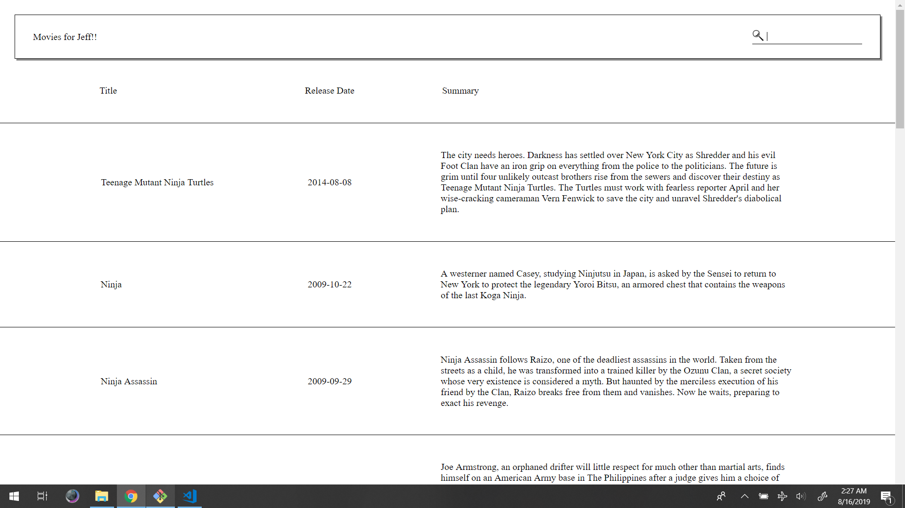
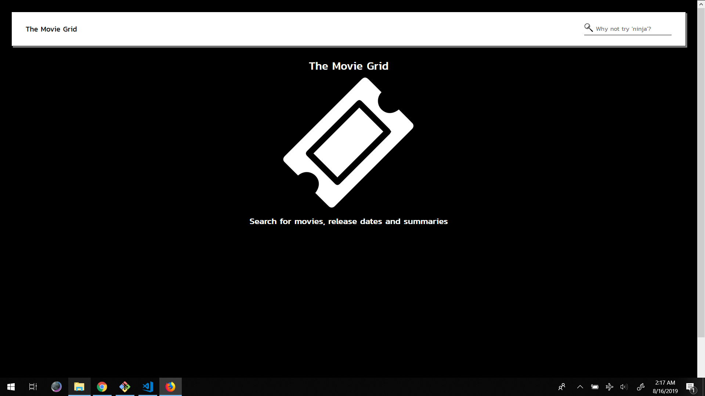
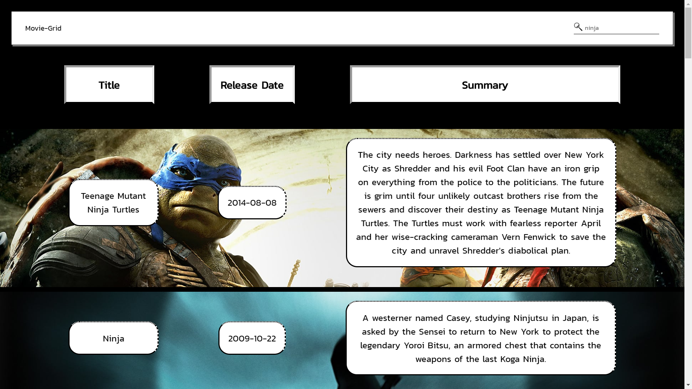

<h1> The Movie Grid </h1>

<h2> Summary </h2>

Search for movie titles, release dates and summaries

<h2> Live link </h2>
<a href="https://hzba000.github.io/movie-grid/"> Live link </a>

<h2> Repo Link </h2>
<a href="https://github.com/hzba000/movie-grid"> Repo link </a>

<h2>Local Installation</h2>
<ul>
  <li> Clone repo to a local directory </li>
  <li> Open a terminal and navigate to the repo </li>
  <li> Open the project folder in a code editor</li>
  <li> Get an API key from <a href="http://api.themoviedb.org">API Source</a>
  <li> Add a .env file to the root directory and supply it with "API_KEY=YOUR_KEY" </li>
  <li> Type 'npm run start' in the terminal to launch the project in your browser</li>
</ul>

<h2> Objectives </h2>
<ul>
  <li>Allow a user to be able to search for a movie given a search string</li> 
  <li>Manage the storage and retrieving of data using Redux</li>  
  <li>Display results in a grid format</li>  
  <li>Create production quality code</li>  
  <li>Return a link to a repo of code</li>  
  <li>BONUS POINTS - Make the UI more attractive</li> 
</ul>

<h2> Original MVP </h2>

<h2> Guiding Page </h2>

<h2> Results Page </h2>

<h2> Known Issues and Things to Do </h2>

Some cosmetic CSS changes need to be made to make sure the app is fully responsive and aligned

Accessibility Issues may need to be addressed

There are compatibility issues with internet explorer/edge

Need to test on Safari

Need to work on adding more tests

There is a third party console error thrown when an image can't be retrieved -- it's been addressed in the code, but I want to clear it from the console

The response from API is pretty fast, but I should probably have a loader

Images are kind of heavy and can take time to render, I should look into shrinking their sizes

